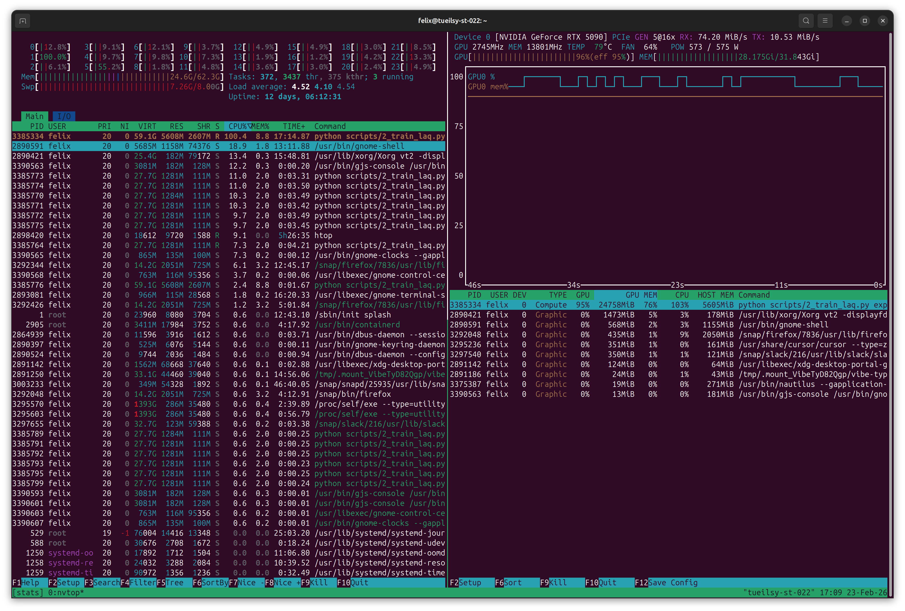

This code is build on [LAPA](https://github.com/LatentActionPretraining/LAPA).

# High-Level Robot Planner

A three-stage robot learning system that learns policies from videos without action labels.

**Three Training Stages:**
1. **Stage 1 (LAQ)**: VQ-VAE compressing frame-to-frame transitions into discrete latent codes
2. **Stage 2 (Foundation)**: Vision-Language model predicting latent actions from images + text
3. **Stage 3 (Finetuning)**: Adapting the foundation model to output continuous robot commands

## Performance and resource efficiency
For performance reasons over the course of the project we switched from Open X Embodiment in rlds format to a preprocessed version that allows direct index based access. With the current setup we achieve full GPU utilization.

<p align="center">
  
</p>

## Repository Structure

```
├── packages/              # Installable Python packages
│   ├── common/           # Shared utilities, logging, data interfaces
│   ├── laq/              # Stage 1: Latent action quantization (VQ-VAE)
│   ├── foundation/       # Stage 2: Vision-Language-Action model
├── config/               # Hydra configurations (modular, composable)
│   ├── experiment/       # Complete experiment setups
│   ├── model/, data/, training/, cluster/  # Config components
├── scripts/              # Training entry points (numbered by stage)
├── tests/                # Unit and integration tests
├── lerobot_policy_hlrp / # Definition of the installable lerobot policy to be used with the lerobot library
├── docs/                 # Documentation (LRZ workflow guide)
└── containers/           # Enroot/Docker definitions for LRZ
```

## Getting Started

### Installation

```bash
# Create conda environment (Python 3.12)
conda env create -f environment.yml
conda activate hlrp

# Install PyTorch 2.9.1 with CUDA support
pip install torch==2.9.1 torchvision==0.24.1 torchaudio==2.9.1 --index-url https://download.pytorch.org/whl/cu130

# Install project packages
pip install -e .

# Verify setup
python scripts/0_setup_environment.py
```

### Running Training

```bash
# Local debug: Small dataset on RTX 5090 or CPU
python scripts/2_train_laq.py experiment=laq_debug

# Modify configuration via CLI
python scripts/2_train_laq.py experiment=laq_debug data.batch_size=16 training.epochs=10

# Full training on LRZ cluster (see docs/)
sbatch slurm/train.sbatch scripts/2_train_laq.py experiment=laq_full
```

## Configuration

Uses [Hydra](https://hydra.cc) for composable configuration. Experiments compose modular config components:

```bash
# Override from CLI
python scripts/2_train_laq.py experiment=laq_full data.batch_size=512 training.optimizer.lr=5e-5
```

See `CLAUDE.md` for architecture and config structure details.

## Development

```bash
# Run tests
pytest tests/

# Format code
black packages/ scripts/ tests/

# Lint
ruff check packages/ scripts/ tests/
```

## Documentation

- **[CLAUDE.md](CLAUDE.md)** - Project architecture, development commands, and setup for Claude Code
- **[docs/lrz_workflow.md](docs/lrz_workflow.md)** - LRZ cluster setup, job submission, and debugging

## Dependencies

Python 3.12 with PyTorch 2.9.1. Key packages: pytorch-lightning, transformers, webdataset, hydra-core, wandb, accelerate.

See `environment.yml` for complete dependency list.

## Citation

```bibtex
@misc{hlrp2024,
  title={High-Level Robot Planner: Learning Policies from Videos},
  author={Your Team},
  year={2024}
}
```

## License

MIT License - See LICENSE file for details

