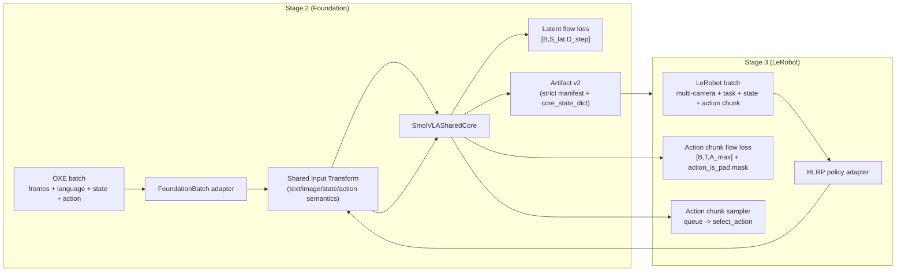
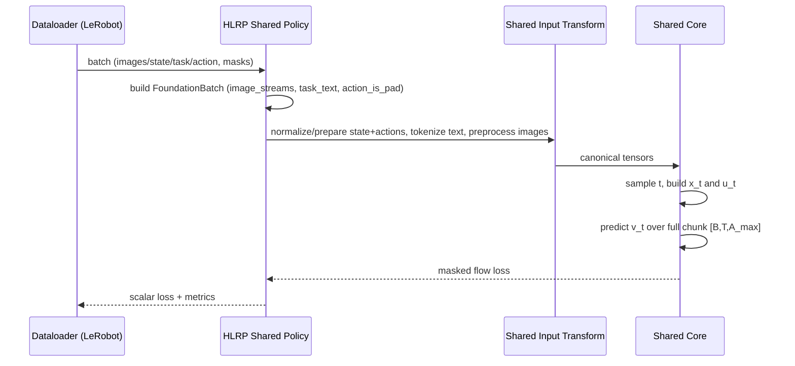
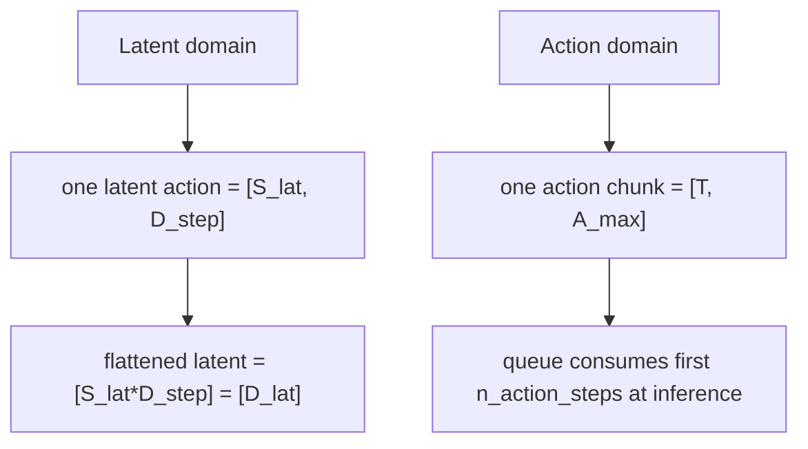

# SmolVLA Shared v2 Visual Guide

This page gives an intuitive map of the new shared pipeline:
- one batch contract
- one transform logic
- one flow objective family for latent and real-action domains

## 1) End-to-End Architecture

## 2) Stage-3 Training Step (Chunk Flow)

## 3) Canonical Batch Shape Cheat Sheet

| Name | Shape | Meaning |
|---|---|---|
| `image_streams[key]` | `[B,O,C,H,W]` or `[B,O,H,W,C]` | Multi-camera observation stream |
| `image_padding_masks[key]` | `[B,O]` or `[B]` | Camera frame validity |
| `task_text` | `len=B` list[str] | Raw instruction text |
| `language_tokens` | `[B,L]` | Optional pretokenized fast path |
| `language_attention_mask` | `[B,L]` | Optional pretokenized mask |
| `state` | `[B,S]` or `[B,O,S]` | Robot state (last obs selected) |
| `target_latent_vectors` | `[B,D_lat]` or `[B,S_lat,D_step]` | Stage-2 latent target |
| `target_actions` | `[B,T,A]` (or `[B,A]` only if `chunk_size=1`) | Action target with strict chunk contract |
| `action_is_pad` | `[B,T]` bool | True means padded timestep |
| `normalization_stats` | dict | Shared state/action mean/std used in Stage2+Stage3 |

## 4) Domain Semantics

## 5) Why update_s changes with chunk flow

With one-step MSE, Stage-3 computed one vector and repeated it over the chunk.
With chunk flow, Stage-3 predicts a full velocity field over `[T, A]` and runs denoising integration over `flow_steps`.

So lower `train/update_s` is expected when moving from one-step MSE to true chunk flow matching.

## 6) Camera Behavior

Current behavior in v2:
- if `camera_keys` is set: use exactly those keys in that order
- else: use all provided streams from adapter in deterministic order
- missing configured cameras can be represented using `empty_cameras` synthetic masked streams
- every used camera key must provide `image_padding_masks[key]`
- `action_is_pad` can be provided as `actions_id_pad` alias in Stage 3 (conflict fails if both are present and differ)
