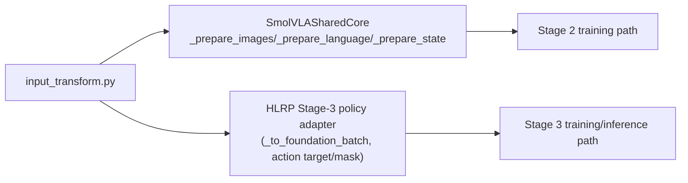

# Shared Transform Parity (Stage 2 vs Stage 3)

This note summarizes where transform logic lives after the v2 refactor.

## Single Source of Truth

Primary module:
- `packages/foundation/backends/smolvla_shared/input_transform.py`

Responsibilities:
- instruction formatting (`newline`, optional `system_prompt`)
- language tokenization or pretokenized pass-through
- image stream selection/preprocess (multi-camera, masks, empty cameras)
- state preparation
- action chunk + pad-mask utilities
- mean/std normalize/unnormalize helpers

## Consumption Map

## Adapter Rules

1. Language:
use `language_tokens+language_attention_mask`, otherwise require `task_text`.

2. Images:
require `image_streams` and `image_padding_masks`.

3. Action padding:
require `action_is_pad` (or `actions_id_pad` alias in Stage 3; conflict fails if both exist and differ).

4. Action chunk:
require exact `[B,T,A]` with `T == chunk_size`, except `[B,A]` only when `chunk_size == 1`.

5. State:
require `state`.

## Practical Outcome

- Stage 2 and Stage 3 now use the same language/image/state transform semantics before core compute.
- Stage 3 action supervision is now chunk-flow (`[B,T,A]`) with explicit pad masking.
- Artifact manifest v2 carries transform-critical settings and `normalization_stats` to block silent drift.
